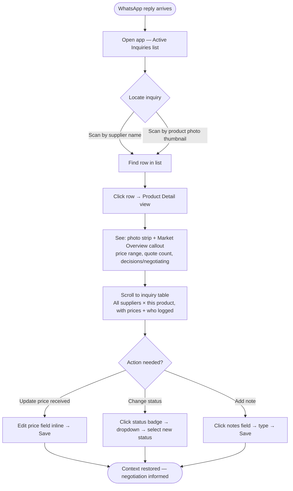
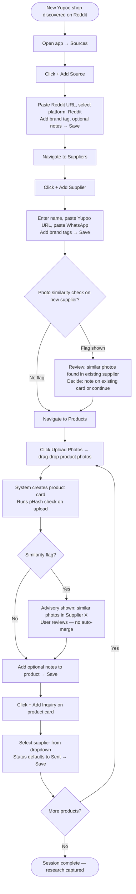
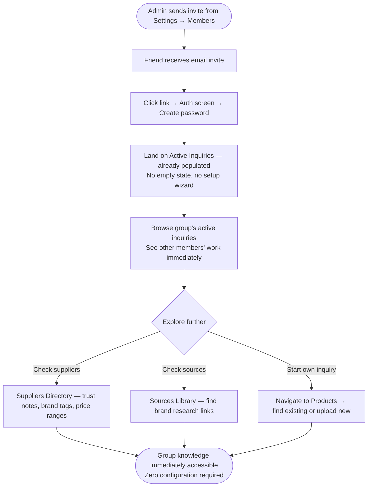
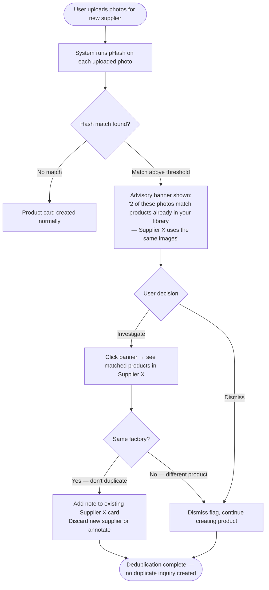

# UX Design Specification proto-yupoo-organizer

**Author:** Jota_
**Date:** 2026-03-20

---

<!-- UX design content will be appended sequentially through collaborative workflow steps -->

## Executive Summary

### Project Vision

proto-yupoo-organizer is a desktop-first web app for a small trusted group of Brazilian importers sourcing goods from Yupoo (Chinese marketplace). It replaces browser bookmarks, unstructured WhatsApp threads, and memory with a cumulative, shared research platform. Every inquiry, price, supplier note, and source feeds a knowledge base that grows over time — so users enter every negotiation informed.

**Tagline:** *Never get lost while importing search.*

### Target Users

- **Primary:** Jota_ and a trusted friend group (3–5 people, invite-only)
- **Tech level:** Intermediate — comfortable with web apps, not developers
- **Device context:** Desktop-first (Chrome primary), Mobile Safari read-only
- **Workflow pattern:** Async — supplier replies arrive hours later due to China/Brazil timezone gap. Users need to reconstruct full context quickly when a reply lands.
- **Mental model:** Think in photos, not product names. Already use WhatsApp for supplier comms.

### Key Design Challenges

1. **Photo-first product identity** — products have no stable text names in the Yupoo ecosystem. Photos are the primary identifier. The UI must make photo-based browsing, recognition, and navigation feel natural, not a workaround.
2. **Inquiry status as deliberate negotiation signal** — the status flow (Sent → Price Received → Negotiating → Decided / Ghosted) tracks buying intent, not just organization. Accidental status transitions could harm real negotiations. Transitions must be visible and intentional.
3. **Context recovery after timezone gap** — a WhatsApp reply can arrive hours or days after the initial inquiry. Users need to reconstruct full context (product photos, competing quotes, supplier notes) in under 10 seconds. Information architecture must support this "return to context" flow.

### Design Opportunities

1. **Supplier card as a living CRM** — go beyond a static form. Surface trust signals, negotiation history, and active inquiries at a glance. Likely the most-used surface in the app.
2. **Price history as negotiation power** — show a clear price range across suppliers before any conversation starts. This is a core differentiator and worth prominent design treatment.
3. **Active negotiations dashboard** — a "what am I negotiating right now?" surface that cuts through all data and shows only what needs attention today, supporting the async workflow pattern.

## Core User Experience

### Defining Experience

The defining user action is **context recovery**: a WhatsApp reply arrives from a Chinese supplier hours after the initial inquiry. The user opens the app and, within 10 seconds, reconstructs full context — product photos, all suppliers contacted for this product, competing quotes, and the supplier's trust notes. This is the moment the app justifies its existence.

Everything else — data entry, supplier cards, price history — serves this moment.

### Platform Strategy

- **Primary platform:** Desktop web (Chrome) — full feature parity, mouse/keyboard interaction
- **Secondary platform:** Mobile Safari — read and lookup only; no full-feature parity required at MVP
- **No offline support needed** — standard fetch-on-load, Supabase backend
- **No native device features** — no camera integration, no push notifications at MVP
- **No SEO surface** — fully auth-gated, zero public pages

### Effortless Interactions

1. **Photo upload as product creation** — drag-and-drop photos directly creates a product card. No product name required. Multi-file upload in one gesture.
2. **Quick capture flow** — adding a supplier, creating a product, and linking an inquiry should be completable in a single session without navigating away from the current context.
3. **Reference price visibility** — the price range for any product across all suppliers and group members should be visible at a glance on the product card, without drilling into sub-pages.
4. **Source library as a shortcut** — starting a new brand research session should begin from the app's source library (saved Reddit/Discord links), not a fresh search. Finding a saved source must require one action, not multiple steps.

### Critical Success Moments

1. **The context recovery moment** — user opens an inquiry record and immediately sees product photos + competing quotes + supplier trust notes. Target: under 10 seconds from app open.
2. **The collaborative reveal** — a user sees their friend already logged a price for a product they're currently researching. First "we're sharing knowledge" experience.
3. **The factory flag moment** — photo similarity detection fires when a new supplier is added. User realizes the app is doing work they used to do manually.
4. **New member instant value** — a new group member logs in, sees a fully populated supplier list with trust notes and brand tags. Zero onboarding required.

### Experience Principles

1. **Context over creation** — the app's primary job is retrieval and context recovery, not data entry. Every UI decision should optimize for "find this fast."
2. **Photos lead, text follows** — photo upload is the starting action for products. No product name required to create, find, or share a product record.
3. **Deliberate transitions, effortless captures** — data entry (adding suppliers, uploading photos) should be as frictionless as possible. Status changes (especially inquiry phase transitions) should require an intentional gesture to prevent accidents.
4. **Shared by default** — all data is group-scoped and immediately visible to all members. There is no private mode, no drafts, no "publish" step.

## Desired Emotional Response

### Primary Emotional Goals

**Confidence and control** is the primary emotional goal. Users should always know where they stand — what's been contacted, what prices exist, what their group has already found. The app replaces anxiety (lost context, forgotten suppliers, missed information) with a calm sense that everything is organized and accessible.

### Emotional Journey Mapping

| Moment | Target Feeling |
|---|---|
| First login (new member) | Instant belonging — "my group already did the work" |
| Adding a new supplier/product | Quick capture satisfaction — frictionless, done fast |
| WhatsApp reply arrives → open inquiry | Relief and clarity — full context recovered immediately |
| Seeing a friend's competing quote | Collaborative power — "we're better together" |
| Photo similarity flag fires | Pleasant surprise — the app caught something manually easy to miss |
| Changing status to "Negotiating" | Intentional confidence — a deliberate, meaningful action |
| Upload or network error | Reassurance — clear error state, no silent data loss |

### Micro-Emotions

- **Confidence over confusion** — every screen answers "where am I and what do I do next" immediately
- **Trust over skepticism** — price history shows attribution (who, when); shared data feels verified, not anonymous
- **Accomplishment over frustration** — a completed inquiry session (supplier added, product created, inquiry linked) should feel finished, not like more steps are hiding
- **Belonging over isolation** — solo sessions still feel like group work; all data carries visible shared provenance

### Design Implications

- **Confidence** → clear information hierarchy; price range always visible on product cards without drilling
- **Calm efficiency** → minimal chrome, data-dense but uncluttered layout, no gratuitous animations
- **Safe from accidents** → inquiry status transitions require a deliberate action (explicit button/dropdown, not drag-and-drop); status label updates immediately as clear feedback
- **Team coherence** → attribution shown everywhere ("logged by Jota_, 2 days ago"); shared provenance creates shared trust
- **Informed power** → price history displayed as a range with context on every relevant surface

### Emotional Design Principles

1. **Organize, don't overwhelm** — the app replaced chaos; it must never add to it. Fewer, clearer surfaces beat comprehensive but crowded ones.
2. **Make the group visible** — attribution, timestamps, and shared history should be present throughout, reinforcing that this is collaborative knowledge, not a personal notebook.
3. **Reward intentional actions** — transitions that carry weight (status changes, adding a red flag) should feel meaningful, not accidental.
4. **Silence is safe** — no surprising changes, no data loss, no ambiguous states. Errors speak clearly.

## UX Pattern Analysis & Inspiration

### Inspiring Products Analysis

**Linear** — Desktop-first, data-dense SaaS tool with deliberate status workflows. Relevant for: inquiry status flow design, sidebar + main content layout, keyboard accessibility, calm/professional visual tone, and efficient list-based navigation. Sets the bar for making structured data feel effortless rather than bureaucratic.

**Airtable (Gallery view)** — Multi-entity structured data with tags, filters, and linked records. Gallery view demonstrates photo-first scanning for product catalogs. Relevant for: tag/filter UI for brands and platforms, linked-record relationships (product → supplier → inquiry), and data-dense card layouts. Anti-pattern: the configuration burden and blank-slate setup experience.

**Pinterest** — Visual grid as primary navigation. Demonstrates "scan photos first, read details on click" — the exact mental model for photo-first product identity. Relevant for: product grid layout, hover-to-preview interactions. Anti-pattern: infinite scroll and social complexity are out of scope.

**Pipedrive (CRM model)** — Supplier-as-contact-card with linked pipeline items. Demonstrates how to surface relationship history (all inquiries, all prices, all notes) within a single entity view without overwhelming. Relevant for: supplier card layout, inquiry pipeline status view, price history attribution.

### Transferable UX Patterns

**Navigation:**
- Sidebar with top-level sections (Suppliers, Products, Inquiries, Sources) + main content area — from Linear. Provides clear orientation without excessive depth.
- Section-level filters (brand tag, status, platform) as persistent sidebar controls — from Airtable. Users filter once and stay filtered.

**Interaction:**
- Status as a labeled dropdown or segmented control, not drag-and-drop — from Linear. Makes transitions deliberate.
- Photo grid with click-to-expand detail panel — from Pinterest + Airtable gallery. Supports "scan first, read details second."
- Inline quick-add for suppliers and inquiries — from Linear's quick-create. Reduces navigation friction during capture sessions.
- Tag chips with color coding for brands and platforms — from Airtable/Linear labels. Scannable at a glance.

**Visual:**
- Card layout for suppliers and products with key metadata visible without clicking — from Pipedrive contact cards.
- Attribution line ("added by Jota_, 3 days ago") as a standard UI element — reinforces shared context everywhere.
- Status badge with color coding on inquiry cards (Sent = neutral, Negotiating = active, Decided = resolved, Ghosted = muted).

### Anti-Patterns to Avoid

- **Blank-slate overwhelm (Notion/Airtable)** — the app must feel functional from the first login, not like an empty canvas requiring setup. Group data is pre-populated; no configuration required to start.
- **Drag-and-drop status changes** — too casual for actions that carry negotiation intent. Explicit controls only.
- **Deep navigation hierarchies** — no more than 2 levels deep to any piece of data. Context recovery in under 10 seconds is impossible with 4-level drilldowns.
- **Notification-heavy surfaces** — this tool is async by design; no activity feeds, no notification badges that create anxiety.
- **Mandatory field overload** — supplier and product creation should require only the minimum. Trust notes, red flags, and elasticity data are additive, not required.

### Design Inspiration Strategy

**Adopt:**
- Linear's sidebar navigation structure and status workflow controls
- Airtable's tag/filter chip pattern for brands and platforms
- Pinterest's photo-grid-first browsing for the Products section

**Adapt:**
- Pipedrive's contact card → Supplier card with trust signals, active inquiry count, and brand tags surfaced at a glance
- Airtable's linked records → Inquiry as the linking entity between product and supplier, with price and status inline

**Avoid:**
- Any pattern that requires configuration before use
- Drag-and-drop for status-sensitive interactions
- Navigation depth beyond 2 levels

## Design System Foundation

### Design System Choice

**Tailwind CSS + shadcn/ui** on Next.js.

### Rationale for Selection

- Native fit with the Next.js/Vercel stack specified in the PRD
- shadcn/ui's component set (cards, dropdowns, badges, dialogs, tables) directly covers the app's data-dense UI needs
- Radix UI primitives provide accessibility (keyboard navigation, ARIA) without additional effort
- Components are owned by the project (not a versioned dependency), enabling full customization without framework conflicts
- Tailwind utility classes enable the Linear-inspired dense, professional aesthetic without fighting CSS defaults
- Appropriate for a small team with no dedicated designer

### Implementation Approach

- Base component set: shadcn/ui for forms, dialogs, dropdowns, badges, navigation sidebar, and data tables
- Custom components: photo grid (masonry or uniform grid for Products section), supplier card with trust signal layout, inquiry status badge system
- No global CSS framework conflicts — Tailwind-only styling throughout

### Customization Strategy

- **Color tokens:** Neutral base (slate or zinc), single accent color for interactive elements, semantic status colors for inquiry badges
- **Status badge system:** Sent (slate/neutral), Price Received (blue), Negotiating (amber), Decided (green), Ghosted (muted/dim)
- **Typography:** System font stack — fast, legible, desktop-appropriate; no custom typeface required at MVP
- **Spacing:** Compact defaults — data-dense surfaces with consistent 4px/8px grid

### Theme Governance Rule

**No arbitrary Tailwind values.** All sizing, spacing, typography scale, color, border-radius, and layout values must be defined as named tokens in `tailwind.config` and referenced by name. Arbitrary values (`text-[10px]`, `w-[240px]`, `gap-[6px]`) are prohibited.

**Required theme token groups to define before first component:**

| Group | Examples to tokenize |
|---|---|
| `fontSize` | `label-xs` (10px), `label-sm` (11px), `label-md` (12px), `body-sm` (13px), `body-md` (14px) |
| `spacing` / `width` | `sidebar` (240px), `thumb-sm` (48px), `thumb-md` (64px) |
| `borderRadius` | already defined in artifacts — verify all values are named |
| `colors` | already defined as semantic tokens — do not add raw hex outside config |
| `letterSpacing` | `widest` for uppercase labels — verify named |

## Core Interaction Design

### 2.1 Defining Experience

> *"Open an inquiry and instantly know everything — what you asked for, what it looks like, who else your group contacted, and what they paid."*

The defining experience is **context recovery**: a WhatsApp reply arrives from a supplier. The user opens the app, navigates to or searches for the inquiry, and within 10 seconds sees: product photos, all parallel inquiries for this product with their statuses, the price range from all suppliers, and the supplier's trust notes. This moment — arriving informed rather than lost — is the product's core value proposition made tangible.

### 2.2 User Mental Model

Users arrive with a "save things" mental model (bookmarks, screenshots, notes). The app must honor this model at entry (frictionless capture), then reveal its collaborative and historical value organically. Users should not need to understand the data model to benefit from it — the value of shared price history and parallel inquiries surfaces automatically when they open a product or inquiry, without requiring any extra steps.

### 2.3 Success Criteria

- User opens an inquiry record and sees product photos + all parallel supplier inquiries + price range in a single view — no additional navigation
- New price quote entered by any group member immediately visible to all others on next load
- Inquiry found by searching product photos or supplier name in under 3 actions from app open
- Status transition requires exactly one deliberate action — no ambiguity about what happened

### 2.4 Novel vs. Established Patterns

**Novel (requires thoughtful introduction):**
- Photo-first product identity — no product name field. Products are found by visual recognition, not text search. Onboarding must communicate this clearly; the photo grid must be prominent enough that users don't look for a "product name" input.
- Shared price history as ambient context — price range surfaced on product cards unprompted. Users accustomed to private notes may be surprised their logged price is visible to the group; this is a feature but must be communicated.

**Established (use proven patterns):**
- Status dropdown for inquiry transitions — familiar from any task/CRM tool
- Tag chips for brand filtering — universal pattern
- Sidebar navigation — learned from Linear, Notion, and countless SaaS tools
- Card-based entity display — universal for CRM/catalog products

### 2.5 Experience Mechanics

**Core flow: Context recovery after a WhatsApp reply**

1. **Initiation:** User opens app on desktop. Landing view shows active inquiries (Sent or Negotiating status) — the most likely entry point for context recovery.
2. **Navigation:** User identifies the inquiry by supplier name or product photo thumbnail in the active inquiries list. One click opens the inquiry detail.
3. **Interaction:** Inquiry detail view shows: product photo gallery (top), inquiry metadata (supplier, status, date), price field, notes field, and below — all other inquiries for this same product (other suppliers, other group members), with their prices and statuses.
4. **Feedback:** Price range summary ("2 quotes: R$45–R$62") visible as a computed field. Status badge updates immediately on change. Attribution line shows who last edited.
5. **Completion:** User updates status or adds a received price. One save action. Returns to active inquiries list, which now reflects the updated state.

## Visual Design Foundation

### Color System

Light theme built on shadcn/ui zinc base with blue accent.

| Role | Tailwind Token | Use |
|---|---|---|
| Background | `zinc-50` | App background |
| Surface | `white` | Cards, panels |
| Border | `zinc-200` | Dividers, card edges |
| Muted text | `zinc-500` | Labels, attribution lines |
| Body text | `zinc-900` | Primary content |
| Accent | `blue-600` | Buttons, links, active states |

**Inquiry status badge system:**

| Status | Background | Text |
|---|---|---|
| Sent | `zinc-100` | `zinc-600` |
| Price Received | `blue-50` | `blue-700` |
| Negotiating | `amber-50` | `amber-700` |
| Decided | `green-50` | `green-700` |
| Ghosted | `zinc-50` | `zinc-400` |

Red flag indicator: `red-500` icon on supplier cards.

### Typography System

- **Font:** Inter via `next/font`
- **Scale:** Page titles `text-xl/600`, card titles `text-[15px]/500`, body `text-sm/400`, meta/labels `text-xs/400`
- **Line height:** `leading-snug` for dense lists; `leading-normal` for free-text notes

### Spacing & Layout Foundation

- **Base unit:** 8px grid
- **Layout:** Fixed left sidebar (240px) + scrollable main content area, full viewport height
- **Card padding:** `p-4` internal, `gap-3` between cards
- **Content density:** Compact — list rows 40–48px, card grids 200–240px wide
- **Max content width:** `max-w-5xl` to prevent over-wide layouts on large monitors

### Accessibility Considerations

- All text/background pairs target WCAG AA (4.5:1 minimum contrast)
- Focus rings via Radix UI defaults (`ring-2 ring-blue-600`)
- All form inputs have visible labels — no placeholder-only patterns

## Design Direction Decision

### Design Directions Explored

Six HTML mockup variations were generated and evaluated (Direction 1–6: Linear List, Dark Sidebar, Split Panel, Dashboard, Photo Gallery, Compact CRM). None were selected. Instead, UI artifacts generated via an external spec tool ("slate_blue_organizer" direction) produced a significantly more refined output that supersedes all six directions.

### Chosen Direction — "The Architectural Curator"

Creative north star: a professional workstation aesthetic — expensive, quiet, highly organized. Utility is elevated to an editorial experience through tonal layering, intentional spacing, and ambient depth rather than borders and shadows.

### Design Rationale

- **Tonal depth over borders:** Sidebar sits on `surface-container-low` (#eff4ff); main content on `surface` (#f8f9ff); cards on `surface-container-lowest` (#ffffff). No 1px dividers — depth is created by background shifts.
- **Glassmorphism top bar:** `bg-white/80 backdrop-blur-md` for the fixed header. Feels premium without competing with content.
- **Active nav state:** Left `border-l-4 border-primary` pill + bold text. No background highlight.
- **Row separation:** `rounded-xl` cards with `space-y-1` gap, no borders. Hover transitions to `surface-container-high` (#dce9ff).
- **Typography:** Uppercase `tracking-widest text-[10px]` for column headers and metadata labels. Creates sharp contrast between content (bold, dark) and data (small, zinc-500).
- **Gradient CTA button:** `bg-gradient-to-r from-primary to-primary-container` for primary actions — adds jewel-like depth.

### Implementation Approach — Screen by Screen

**Active Inquiries (default landing):** Table layout with `grid-cols-[64px_2fr_1.5fr_1fr_1fr_120px]`. Photo thumbnail (48×48 rounded-lg) + supplier name + ref code as two-line cell. Status badge inline. Attribution ("added by Jota_, 3 days ago") in `text-[10px] text-outline`. No row borders.

**Suppliers List:** Full-width list rows with supplier photo, inline trust quote, brand tag chips, typical price range (right-aligned, prominent), active inquiry count + last status. Red flag shown as inline warning icon + warning text directly in the row — no drilling required to see the flag.

**Supplier Detail:** Two-column layout. Left: supplier name, brand tags, Yupoo URL + WhatsApp links. Right: "Trust Intelligence" panel with free-text notes, red flag toggle, and negotiation elasticity (Opening → Final with % avg). Tabs below: Linked Inquiries / Linked Products / Feedback & QC.

**Product Detail:** Full-width horizontal photo strip at top (scrollable). "Market Overview" callout prominent above the inquiry table: quote count, price range, decisions/negotiating tally. Inquiry table: supplier / status badge / price / who logged / when. This is the context recovery screen — all information visible without sub-navigation.

**Products Gallery:** Uniform card grid. Each card: product photo, status badge overlay, price range, supplier count. Duplicate photo warning badge where pHash match detected.

**Sources Library:** Clean table — platform badge / URL / brand tags / notes / active toggle. No decorative footers.

### Components to Carry Forward

| Component | Pattern |
|---|---|
| Status badge | Inline `rounded` chip, semantic colors per spec |
| Brand tag chip | Small `rounded-full` pill, `surface-container-high` bg |
| Red flag | `error` (#ba1a1a) icon, no background, bleeds into surface |
| Attribution line | `text-[10px] text-outline`, always present on inquiry rows |
| Price range | `font-semibold text-primary`, right-aligned on list rows |
| Trust Intelligence panel | Right sidebar panel on supplier detail, free-text + elasticity data |
| Negotiation elasticity | Opening → Final with directional arrow + % avg label |

## User Journey Flows

### Journey 1: Context Recovery (Core Path)

**Trigger:** A WhatsApp message arrives from a supplier hours after the initial inquiry.
**Entry point:** App open → Active Inquiries (default landing view)

**Optimization:** Active Inquiries list shows product photo thumbnail + supplier name side by side — users identify their inquiry visually, not by ref code. Maximum 2 clicks from app open to full context.

---

### Journey 2: New Brand Research Session

**Trigger:** Jota_ finds a Reddit post with Yupoo shop links for a new brand.
**Entry point:** Sources Library → Save source first, then build out

**Optimization:** Photo upload is single-gesture (drag-drop area prominent). No product name field. Inquiry creation pre-selects last-used supplier.

---

### Journey 3: New Member Gets Instant Value

**Trigger:** Admin adds a friend via Settings → Members.
**Entry point:** Email invite → First login

**Optimization:** No onboarding wizard. No empty states. New members land directly in Active Inquiries with live group data visible.

---

### Journey 4: Same Factory Detected (Edge Case)

---

### Journey Patterns

| Pattern | Implementation |
|---|---|
| **Entry always Active Inquiries** | Default route after login — no dashboard required |
| **Photo-first recognition** | Thumbnail always shown in list rows — never text-only |
| **Attribution everywhere** | Every inquiry row, price, and note shows who + when |
| **2-click max to context** | List → Detail is the deepest path for context recovery |
| **Advisory, never blocking** | pHash flags, red flags, price comparisons are informational only |
| **Status as explicit action** | Status change always via dropdown — never incidental |

### Flow Optimization Principles

1. **Default to populated** — no screen appears empty if group data exists; first login lands in live data
2. **Capture fast, enrich later** — minimum required fields at creation; all other fields are additive
3. **Surface group knowledge unprompted** — price history and parallel inquiries appear automatically on detail views
4. **Errors are recoverable, never silent** — failed uploads show clear error with retry; no partial records created

## Component Strategy

### Methodology: Atomic Design

All components are classified and built bottom-up. Organisms never introduce new visual primitives — they compose existing molecules and atoms. Theme tokens are the single source of truth for all visual values. No arbitrary Tailwind values at any level.

---

### Atoms — Indivisible UI Units

shadcn/ui primitives or single-purpose custom elements. No atoms contain business logic.

| Atom | Source | Notes |
|---|---|---|
| `Button` | shadcn/ui | primary (gradient), secondary, tertiary (text-only) variants via cva |
| `Input` | shadcn/ui | ghost border, sharp focus ring |
| `Textarea` | shadcn/ui | notes fields |
| `Badge` | shadcn/ui (extended) | base + semantic status variants via cva |
| `Label` | shadcn/ui | |
| `Avatar` | shadcn/ui | user initials, group member display |
| `Switch` | shadcn/ui | sources active toggle |
| `Icon` | Material Symbols Outlined | standardized icon set per design artifacts |
| `Skeleton` | shadcn/ui | loading placeholders |
| `BrandTagChip` | custom | display / filter / removable variants |
| `PriceRange` | custom | "R$45–R$62" formatted display, `font-semibold text-primary` |
| `AttributionLine` | custom | "added by Jota_, 3 days ago" — `label-xs text-outline` |
| `PhotoThumb` | custom | square image, rounded corners, broken-state fallback |
| `RedFlagIcon` | custom | `error` color, no background — bleeds into surface |

---

### Molecules — Simple Atom Compositions

Single focused purpose. Combine 2–4 atoms. No direct data fetching.

| Molecule | Atoms used | Purpose |
|---|---|---|
| `StatusDropdown` | `Badge` + `DropdownMenu` + `Icon` | Status badge that opens transition picker on click |
| `BrandTagGroup` | `BrandTagChip` × n | Horizontal chip list, wraps gracefully |
| `SearchField` | `Input` + `Icon` | Search bar with leading icon |
| `InquiryMeta` | `AttributionLine` + `PriceRange` + `StatusDropdown` | Three-field summary block for rows and detail |
| `SupplierLink` | `Icon` + text | Yupoo URL or WhatsApp link with copy/open action |
| `NegotiationElasticity` | `PriceRange` × 2 + `Icon` + `Label` | Opening → Final with % avg label |
| `SimilarityAdvisoryBanner` | `Alert` + `Icon` + `Button` | pHash match advisory — dismissable, non-blocking |
| `MarketOverviewCallout` | `PriceRange` + stat counts + `Label` | Price benchmarking summary panel |
| `FileUploadInput` | `<input type="file">` + `Icon` + `Label` | Accessible file trigger inside upload zone |

---

### Organisms — Complex Sections

Compose molecules and atoms into complete UI sections. May contain local state.

| Organism | Composed of | Screen(s) |
|---|---|---|
| `InquiryRow` | `PhotoThumb` + `InquiryMeta` + `BrandTagGroup` + `Button` × 2 | Active Inquiries |
| `SupplierRow` | `PhotoThumb` + `BrandTagGroup` + `InquiryMeta` + `RedFlagIcon` + `Icon` | Suppliers Directory |
| `ProductCard` | `PhotoThumb` + `StatusDropdown` + `PriceRange` + `SimilarityAdvisoryBanner` | Products Gallery |
| `ProductPhotoStrip` | `PhotoThumb` × n + scroll container | Product Detail |
| `TrustIntelligencePanel` | `NegotiationElasticity` + `RedFlagIcon` + `Switch` + `Textarea` | Supplier Detail |
| `PhotoUploadZone` | `FileUploadInput` + `Skeleton` + `SimilarityAdvisoryBanner` + progress | Product creation |
| `InquiryTable` | `InquiryRow` × n + `Pagination` | Active Inquiries, Product Detail |
| `SupplierDirectory` | `SupplierRow` × n + `SearchField` + `BrandTagGroup` | Suppliers page |
| `SideNav` | `Avatar` + `Icon` × n + active state pill | All pages |
| `TopBar` | `SearchField` + `Button` × 2 + `Icon` × 2 (glass bg) | All pages |

---

### Templates — Page Layouts Without Data

| Template | Layout |
|---|---|
| `AppShell` | Fixed `SideNav` (240px) + fixed `TopBar` + scrollable main content |
| `ListTemplate` | `AppShell` + page header + filter row + list area + pagination |
| `DetailTemplate` | `AppShell` + breadcrumb + two-column (main content + right panel) |
| `GalleryTemplate` | `AppShell` + page header + filter sidebar + photo grid |

---

### Pages — Templates With Real Content

| Page | Template | Primary Organisms |
|---|---|---|
| Active Inquiries | `ListTemplate` | `InquiryTable` |
| Suppliers Directory | `ListTemplate` | `SupplierDirectory` |
| Supplier Detail | `DetailTemplate` | `SupplierRow` (header) + `InquiryTable` + `TrustIntelligencePanel` |
| Products Gallery | `GalleryTemplate` | `ProductCard` grid + `PhotoUploadZone` |
| Product Detail | `DetailTemplate` | `ProductPhotoStrip` + `MarketOverviewCallout` + `InquiryTable` |
| Sources Library | `ListTemplate` | sources table |

---

### Implementation Roadmap (Atomic Order)

**Phase 1 — Atoms + critical Molecules**
All atoms · `StatusDropdown` · `InquiryMeta` · `MarketOverviewCallout`

**Phase 2 — AppShell + Core Organisms**
`AppShell` · `SideNav` · `TopBar` · `InquiryRow` · `InquiryTable` → Active Inquiries page functional

**Phase 3 — Supplier + Product Organisms**
`SupplierRow` · `TrustIntelligencePanel` · `PhotoUploadZone` · `ProductCard` · `ProductPhotoStrip` → all core screens functional

**Phase 4 — Templates + Pages wired to data**
Wire templates to Supabase queries, apply RLS scoping, connect pHash advisory flow

## UX Consistency Patterns

### Button Hierarchy

| Level | Atom variant | When to use | Example |
|---|---|---|---|
| Primary | gradient-filled, `on-primary` text | One per screen — the most important action | "Add Inquiry", "Save" |
| Secondary | outlined, `primary` text | Supporting actions | "Add Product", "Filter by Brand" |
| Tertiary | text-only, `primary` text, bg on hover | Low-priority or destructive (with confirmation) | "Edit", "Dismiss", "Delete" |

**Rule:** Never show two Primary buttons on the same view. The `TopBar` carries the primary CTA for the current section.

### Feedback Patterns

| Situation | Pattern | Component |
|---|---|---|
| Successful save | Optimistic update — field updates immediately, no toast | inline state change |
| Failed save | Inline error below field + field border shifts to `error` | shadcn/ui `FormMessage` |
| Advisory (non-blocking) | Dismissable banner above content | `SimilarityAdvisoryBanner` |
| Destructive action confirm | `Dialog` with explicit "Yes, delete" + cancel | shadcn/ui `Dialog` |
| Upload progress | Per-file progress bar inside `PhotoUploadZone` | inline progress atom |
| Supabase downtime | Full-page error state with retry — never silent | page-level `Alert` |
| Status transition | Immediate optimistic update — badge changes before API confirms | `StatusDropdown` |

### Form Patterns

- **Minimum required fields only** — enrichment fields (trust notes, red flag, elasticity) are additive, presented after creation
- **Visible labels always** — no placeholder-only fields; `Label` above every `Input`
- **Inline validation** — errors appear on blur, not on submit; field-level not form-level
- **Save is explicit** — single "Save" button commits changes; exception: `StatusDropdown` transitions are single-action
- **Destructive actions require confirmation** — always open a `Dialog` first

### Navigation Patterns

- **Active state** — `border-l-4 border-primary` pill + bold text; no background fill
- **Breadcrumb** — Detail pages only (`Suppliers > Uncle Lin`); not on list pages
- **Back navigation** — breadcrumb link on detail pages; no browser back dependency
- **Max depth: 2 levels** — List → Detail is the full depth
- **Default route** — always Active Inquiries after login

### Empty State Patterns

| Context | Behaviour |
|---|---|
| First group login (no data) | "Add your first supplier to get started" with primary CTA |
| New member joins (data exists) | Never shows empty — group data pre-populated |
| Filtered list returns no results | "No results for [filter]" + "Clear filters" link |
| Product with no inquiries | "No inquiries yet — add one" with `Button` |
| pHash no matches | Silent — no empty state; matches only appear when found |

### Loading State Patterns

- **List pages** — `Skeleton` rows at the same height as real rows (no layout shift)
- **Detail pages** — `Skeleton` blocks matching the layout of their content
- **Photo upload** — per-file `Skeleton` cards in upload zone while processing
- **Status transitions** — inline spinner on `StatusDropdown`; row not disabled during optimistic update

### Search and Filter Patterns

- **Brand filter chips** — above list on all filterable pages; active chip filled, inactive outlined
- **Search field** — in `TopBar`; searches current section's primary entity
- **Filters persist within session** — selected filter stays active while navigating within a section
- **Immediate filter** — no "Apply" button; chip toggles take effect instantly

### Modal and Overlay Patterns

- **Create/Edit forms** — `Sheet` (side panel); keeps list context visible
- **Confirmations** — `Dialog` (centered) for destructive actions only
- **Detail views** — always a dedicated page, never a modal
- **Photo lightbox** — `Dialog` with full-size photo + prev/next; triggered from `ProductPhotoStrip`

## Responsive Design & Accessibility

### Responsive Strategy

**Desktop (primary — full feature parity):**
Fixed `SideNav` (240px) + fixed `TopBar` + scrollable main content. All organisms, filtering, creation flows, and status transitions available. `max-w-5xl` content constraint prevents over-wide layouts. Photo grids use named column tokens (`grid-cols-gallery`, `grid-cols-inquiry`).

**Mobile Safari (secondary — read and lookup only):**
`SideNav` collapses to a bottom tab bar (4 tabs: Inquiries, Suppliers, Products, Sources). `TopBar` simplifies to logo + search icon. List views render single-column. Detail views render stacked (no two-column split). Creation flows deferred to desktop — mobile shows "Use desktop to add" prompt on creation CTAs. All read/lookup surfaces fully functional.

**Tablet (not explicitly supported):**
Renders desktop layout. `AppShell` adapts via `md:` prefix where sidebar needs to be toggleable.

### Breakpoint Strategy

Desktop-first. Tailwind breakpoints used in reverse (default = desktop, `md:` and below = adaptation). All breakpoint values defined as theme tokens — no arbitrary `max-width` or `min-width` values in component classes.

| Breakpoint | Width | Behaviour |
|---|---|---|
| default | ≥1024px | Full `AppShell` — fixed sidebar + full feature set |
| `md` | 768px–1023px | Sidebar collapses to icon-only strip (240px → 64px) |
| `sm` | <768px | Mobile layout — bottom tabs, single column, read-only CTAs |

### Accessibility Strategy

**Target: WCAG AA functional compliance** — not certified, but meeting the standard in practice. Radix UI primitives (via shadcn/ui) provide keyboard navigation and ARIA for free.

| Category | Requirement |
|---|---|
| Color contrast | All text/bg pairs ≥ 4.5:1 — zinc-900 on white = 19:1 ✓, blue-600 on white = 5.9:1 ✓ |
| Focus indicators | `ring-2 ring-primary` via Radix defaults — sharp, no glow |
| Keyboard navigation | All interactive elements reachable via Tab; `StatusDropdown` navigable with arrow keys |
| ARIA roles | `role="row"` on `InquiryRow`, `role="region"` on `MarketOverviewCallout`, `aria-label` on icon-only buttons |
| Screen reader | Status changes via `aria-live="polite"`; similarity advisory via `role="alert"` |
| Touch targets | Minimum 44×44px at `sm` breakpoint — named token `touch-target` |
| Images | All `PhotoThumb` images require `alt` — derived from supplier name or "Product photo [n]" |
| Forms | All inputs have associated `Label` via `htmlFor` — no placeholder-only fields |

### Testing Strategy

**Responsive:** Chrome DevTools during development · real device Safari on iPhone before release · visual regression desktop vs. mobile per screen

**Accessibility:** `axe-core` browser extension per screen · keyboard-only walkthrough of context recovery + research session flows before release

### Implementation Guidelines

- Use `sm:` prefix for mobile overrides — never mobile-first and override up
- All layout widths, sidebar dimensions, and touch target sizes defined as theme tokens
- `AppShell` manages the responsive switch — individual organisms do not contain layout breakpoint logic
- Radix UI keyboard behaviour inherited from shadcn/ui — do not override focus management without explicit reason
- `PhotoThumb` always requires `alt` prop — TypeScript enforced
